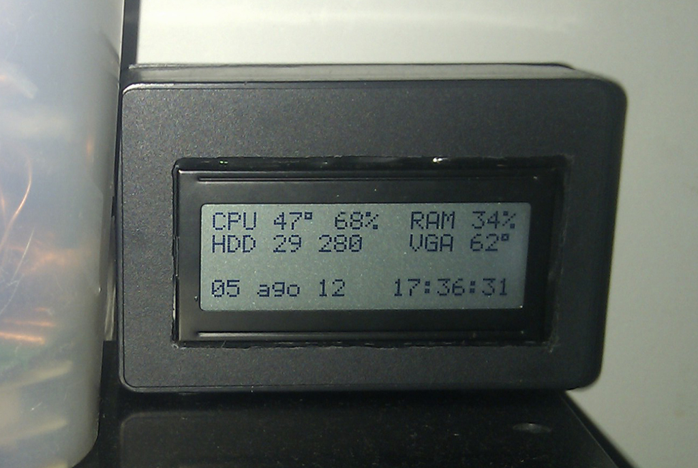
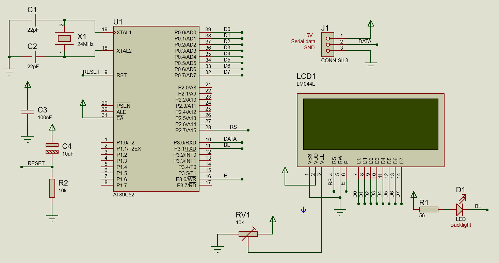

# lcdterminal
Basic 8051 project to create a basic UART viewer using a 20x4 LCD 

It supports certain extended commands to interact with [LCD Smartie](http://lcdsmartie.sourceforge.net/)'s protocol, so for example it can be used to monitor resource usages.

# Hardware

Proteus-editable Schematic is available in the `lcdterminal.pdsprj` file

To simplify the software, it uses the "external memory" feature of the 8052 to generate the `E` pulses for the `HD44780` LCD controller. That is achieved by defining two variables in `xdata`, at locations `0x0000` and `0x8000` (for `RS=0` and `RS=1` commands).

# Software

Baudrate is fixed to 9600 bps, and can be changed by modifying the `RCAP2H` and `RCAP2L` registers. When using a 24 MHz crystal, the following values should be used:
- 2400 bps: `FF C8`
- 4800 bps: `FF 64`
- 9600 bps: `FF B2`
- 19200 bps: `FF D9`
- 57600 bps: `FF F3`

# Warning
This source code is at least 9 years old. It doesn't reflect modern coding skills, and shouldn't be taken as an example for anything you might be developing today. 
